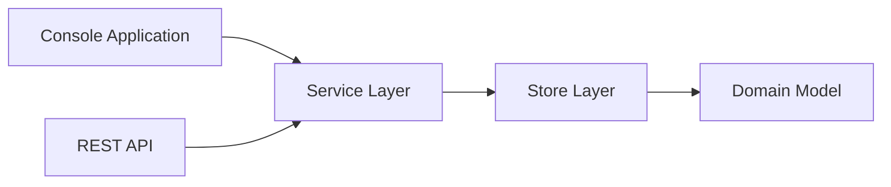

Task List Application

A task management application built as part of the Ortec Finance Software Development Assessment.

The application allows users to organize work into projects, manage tasks, assign deadlines, mark tasks as completed, and view upcoming work through both a console interface and a REST API.

The primary goal of this solution is not only to provide the requested functionality, but also to demonstrate software design principles, separation of concerns, testability, and maintainability.

# Overview

This application manages projects and tasks.

A project contains multiple tasks. Tasks can be marked as completed, assigned a deadline, and queried through either:
 
* An interactive console application
* A REST API built with Spring Boot

Both interfaces use the same domain and service layer, ensuring consistent behaviour regardless of how the application is accessed.

# Features

Project Management

* Create projects
* List projects

Task Management

* Add tasks to projects
* Mark tasks as completed
* Mark tasks as incomplete
* Assign deadlines

Reporting

* Display all projects and tasks
* Show tasks due today
* Show tasks grouped by deadline

# Architecture
The solution follows a layered architecture that separates concerns between the user interface, business logic, and data persistence.

## Layers

### UI Layer
Console and REST API both use the same service layer.

### Service Layer
Contains business logic and coordinates operations across repositories.

### Domain Layer
Contains the core domain objects: Project and Task.

### Persistence Layer
In-memory repositories provide data storage with automatic ID generation.

## Design Principles
- Separation of concerns
- Testability
- Modularity
- Consistency across interfaces



# The Domain Model
Projects and tasks are not symmetric entities. A task has no meaning outside a project, you can't create a task without knowing which project it belongs to, you can't meaningfully display tasks without their project context, and deleting a project should cascade to its tasks automatically. This is the classic aggregate root pattern from Domain-Driven Design: Project is the aggregate root, Task is owned by it. This shapes every other decision below.

Tasks need a globally unique, stable, server-assigned identifier, not a project-scoped one. The original code uses incrementing longs starting at 1. The problem: if you ever expose tasks directly via REST (GET /tasks/{id}), a project-scoped counter (project A task 1, project B task 1) forces you to always include the project in the lookup. A globally unique id, either a sequential long across all tasks, or a UUID, means any endpoint that needs a single task can find it without knowing its project. UUID is the more production-realistic choice (no coordination needed across distributed instances, no information leakage about total task count), but sequential long is simpler and entirely defensible for this scope.

# The persistence model
Project and Task should be separate entities with a foreign key, not nested objects in a Map. The in-memory Map<String, Project> where each Project holds a List<Task> is a perfectly valid in-memory representation, but it bakes in a traversal pattern ("to find a task, walk all projects") that becomes a full table scan in a real database. Designing with a tasks table with a project_id foreign key from the start means a future JPA implementation is a natural fit, findTaskById becomes a direct indexed lookup, not a scan.

The store interface should mirror Spring Data's CrudRepository vocabulary. save, findById, existsById, findAll, deleteById, not invented names. This has a concrete payoff: a future JpaProjectStore would implement these methods by delegating to a JpaRepository, with no vocabulary translation layer needed. A findByName is better than findById when the lookup key is a natural business name rather than a surrogate id, for the reason below.

Project name vs. a separate id as the project's identity. Names are human-readable and appear in URLs naturally, but they're mutable, renaming a project breaks any bookmarked or cached URL. A surrogate id (UUID or numeric) is stable regardless of what the project is called. For a REST API that expects to be long-lived or consumed by external clients, a UUID id field on Project alongside its name is the correct design. The URL becomes /projects/{id} (stable), while the display name is just a field that can change freely. For this assignment's scope, either is defensible, but if you're designing the "perfect" model, UUID id is the right call, and you'd use findById(UUID id) from the store.

# The REST model
Resources map to the domain's aggregate structure: /projects/{id} for projects, /projects/{id}/tasks/{taskId} for tasks. Tasks are nested under projects in the URL because they're genuinely owned by projects, this hierarchy communicates the domain model directly. A flat /tasks/{id} endpoint is also reasonable for direct task access (and makes sense if task ids are globally unique), but the primary resource path should reflect ownership.
Task ownership validation in the PUT /projects/{id}/tasks/{taskId} endpoint. Since task ids are globally unique, the {id} (project id) in the path is technically redundant for lookup, but it's not redundant semantically. A PUT /projects/secrets/tasks/3 that silently succeeds when task 3 actually belongs to training is a REST contract violation: the URL claims a relationship that doesn't exist. The correct behavior is to look task 3 up, verify it belongs to project secrets, and return 404 if it doesn't. This validation cost is trivially small once you have a findTaskById that returns the task with its projectId, just compare.
POST /projects returns 201 Created with the full created ProjectResponse in the body, including the server-assigned id. This is the REST convention for creation endpoints: the client needs the id to construct further requests (POST /projects/{id}/tasks), so returning the full resource in the creation response avoids a round-trip GET. A 201 with no body forces the client to parse the Location header or make a follow-up request, both are worse UX for an API consumer.
PUT vs PATCH for task updates. Using PUT with params= disambiguation (?deadline= vs ?done=) is a pragmatic solution that avoids a request body for simple single-field updates. The more semantically correct approach for the "perfect" model: a single PATCH /projects/{id}/tasks/{taskId} with a request body containing whichever fields to update. PATCH is defined as partial update; PUT is defined as full replacement. A body like {"deadline": "25-11-2024"} or {"done": true} or both together is cleaner than two PUT endpoints disambiguated by query param, and scales naturally if more task fields are added later.

# The console model
TaskList takes its services via constructor injection, never constructs them internally. This is what makes it possible to run console and REST against the same data — the application entry point constructs the Spring context, pulls the singleton service beans from it, and passes them to TaskList. If TaskList constructed its own services internally, you'd always have two disconnected copies of the data. Constructor injection is both the testability requirement (tests can pass any implementation) and the "run both simultaneously" requirement (both adapters share one object graph).

# The exception model
One exception type per distinct failure condition, all unchecked. ProjectNotFoundException, TaskNotFoundException, ProjectAlreadyExistsException, InvalidInputException, each maps to a different HTTP status (404, 404, 409, 400) and a different user-facing message. Collapsing these into one generic AppException with a status code field saves files but loses type safety, the compiler can no longer tell you whether a method can throw a not-found vs. a conflict, and the exception handler becomes an instanceof chain rather than one clean @ExceptionHandler per type.
A single @RestControllerAdvice translates all exceptions to HTTP responses. This means zero try/catch in controller methods, every controller method is clean business logic (parse request -> call service -> return response). Exception translation is a cross-cutting concern and belongs in one place, not scattered per-endpoint.

# The test model
Unit tests for every service class, directly constructing real implementations with no mocking. new ProjectCommandService(new ProjectStore()), no @MockBean, no Mockito. Mocking the store would mean testing the service in isolation from the thing it actually depends on; since ProjectStore is fast (in-memory), deterministic, and has no I/O, there's no reason to mock it, and using the real thing means tests catch real integration bugs between service and store, not just "does the service call the right mock method."
Integration tests for the REST layer using @SpringBootTest + MockMvc. These test the full stack, controller, service, store, exception handler, in one pass. They're slower than unit tests but cover the wiring, which unit tests can't. 

# Project Structure

```text
src
├── main
│   └── java
│       └── com.ortecfinance.tasklist
│           ├── controller
│           ├── domain
│           ├── dto
│           ├── exception
│           ├── mapper
│           ├── service
│           ├── store
│           ├── TaskList.java
│           └── TaskListApplication.java
│
└── test
```

# Testing Strategy

The solution contains tests at multiple levels.

## Unit Tests

Verify:

- Service behaviour
- Validation rules
- Exception handling
- Repository interactions

Run:

mvn test

## Integration Tests

Implemented using:

- SpringBootTest
- MockMvc

Verify:

- Controller mappings
- Request/response serialization
- Exception translation
- End-to-end REST behaviour

## Console Tests

Console functionality is tested using piped input/output streams to simulate user interaction and verify command execution and output formatting.


# Getting Started
-Prerequisites
* Java 21 or newer
* Maven 

-Verify installation
* java -version
* mvn -version

# Installation
* Clone the repository: git clone <repository-url>
* Navigate to the project: cd task-list-app
* Unit Tests: mvn test
* Build the project: mvn clean install


# Running the Application
* Start the application: mvn spring-boot:run
* The API will be available at: http://localhost:8080

# Assumptions

* Project names are unique.
* Tasks belong to exactly one project.
* Deleting a project removes all associated tasks.
* In-memory persistence is sufficient for the scope of this assessment.


# Enhancements
The current implementation intentionally uses in-memory storage to keep the focus on design and behaviour.
Possible future enhancements include:
1. JPA Persistence
    * Spring Data JPA
    * H2 Database
2. OpenAPI Documentation
    Generate interactive API documentation using SpringDoc OpenAPI.
3. Model improvements

These enhancements can be found in the open pull request titled "jpa persistence and openapi doc"

# Swagger UI
Once you run the application, you can view the interactive documentation in your browser at:
* Swagger UI Page: http://localhost:8080/swagger-ui/index.html
* OpenAPI Spec (JSON): http://localhost:8080/v3/api-docs


